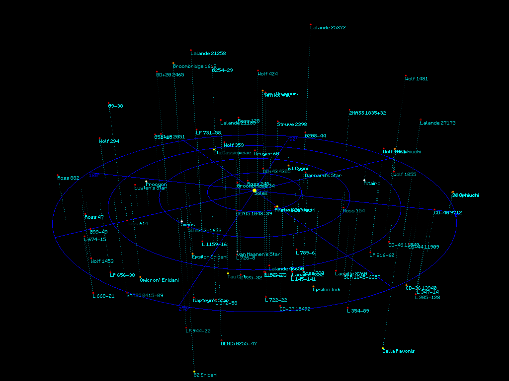

# Star map

This program is an attempt to reproduce visual mood (?) of (?)
from ...
on what can be found at [atunivers.free.fr](http://atunivers.free.fr/)

## Build instructions

On linux:

    make
    ./main

You will need the following libraries installed:

* SDL
* SDL_ttf

## How to use

* mouse: rotate map
* mouse wheel: zoom
* esc: quit

## Screenshots

